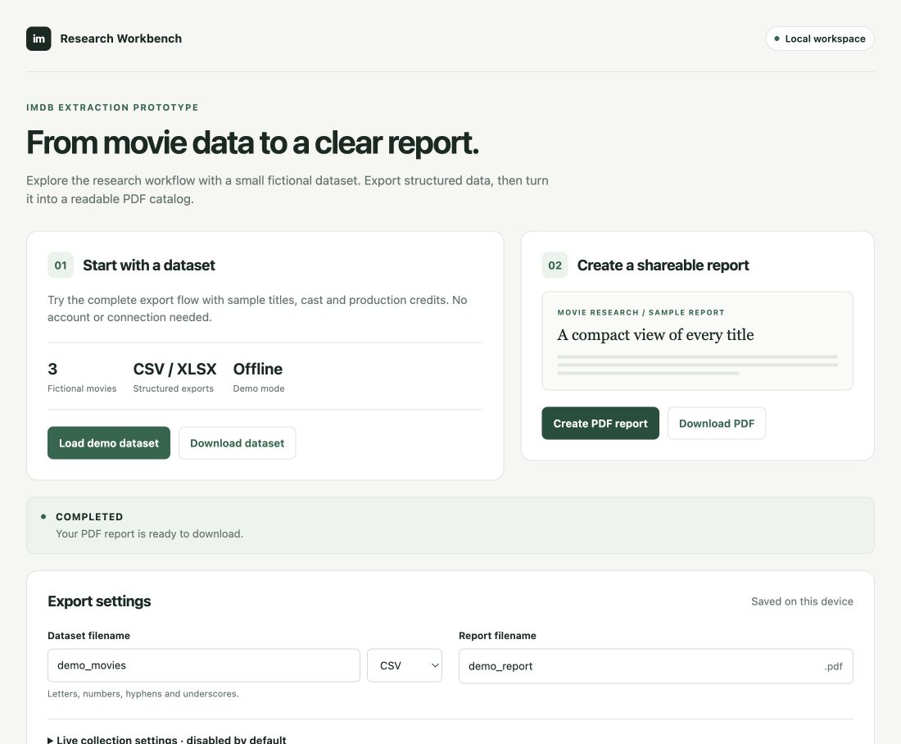

# IMDb Film Research Workbench

[](https://github.com/pol4xer/imdb_prod/actions/workflows/ci.yml)

A local Python application that turns film research data into CSV/Excel exports
and readable PDF reports. A Flask dashboard connects a Scrapy collection
prototype, tabular validation, and a Jinja2 reporting pipeline.

**Status:** portfolio prototype with a working offline demonstration. Live IMDb
collection is optional, disabled by default, and has not been tested against the
current website. The included films, people, and companies are fictional.



[View the fictional sample PDF](docs/examples/imdb-demo-report.pdf) ·
[Inspect the sample data](examples/movies.csv) ·
[Read the architecture](docs/ARCHITECTURE.md)

## Try it locally

Use Python 3.12 or 3.13 and Poetry 2:

```bash
git clone https://github.com/pol4xer/imdb_prod.git
cd imdb_prod
poetry install
make demo
make run
```

`make demo` creates `var/demo/demo_movies.csv` and `var/demo/demo_report.pdf`
from the three fictional records in [`examples/movies.csv`](examples/movies.csv).
It makes no network requests and needs no account or cookies. Initial dependency
installation requires network access.

Open [127.0.0.1:8000](http://127.0.0.1:8000), select **Load demo dataset**, then
**Create PDF report**. Download the dataset or PDF when its task completes. The
web demo creates its own local copy; it does not depend on running `make demo`
first.

The web app stores settings, uploads, and exports under
`~/.local/share/imdb-portfolio` by default. Set `IMDB_ROOT=./var` to use the ignored
`var/` directory instead. See [setup](docs/SETUP.md) for configuration.

## What the code demonstrates

| Area | Implementation |
| --- | --- |
| Data collection | Scrapy request chains for company filmographies, summaries, cast, and production credits |
| ETL | Shared CSV/XLSX readers, company URL validation, explicit export columns, and compatibility with earlier input formats |
| Reporting | Company-grouped PDF reports, escaped Jinja2 templates, validated list fields, and self-contained rendering |
| Web application | Flask application factory, background task status, upload handling, and downloadable artifacts |
| Local configuration | Validated YAML, configurable runtime paths, CSRF checks, and live collection enabled only by explicit configuration |
| Development | Locked Poetry dependencies, Ruff, and offline tests using fixtures, temporary files, and real PDF generation |

Start at [`flask_app.py`](flask_app.py) for the workflow,
[`tabular.py`](imdb_extractor/tabular.py) for data boundaries, and
[`movie_to_pdf_converter.py`](imdb_extractor/movie_to_pdf_converter.py) for report
creation.

## Verify the project

```bash
make check
```

This checks project metadata and the lockfile, linting, formatting, and tests.
Tests run locally without IMDb requests. They establish behavior of the local
workflow and parsing helpers, not compatibility with the current IMDb website.
More commands are in [development notes](docs/DEVELOPMENT.md).

## Scope and limitations

- This is a local workbench with one background task at a time. It has no user
  accounts, persistent job queue, or production deployment setup.
- The live collector relies on IMDb Pro page structure and a session supplied by
  the operator. Those selectors and endpoints may need further maintenance.
- Older exploratory movie and producer spiders remain in the source tree. They
  are outside the supported dashboard/demo workflow.
- Demo output illustrates the software, not real film credits or IMDb data.
- The project retains its proprietary license designation in
  [`pyproject.toml`](pyproject.toml).
