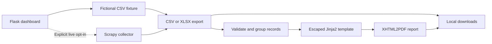

# Architecture

The workbench has two ways to obtain a dataset: load the fictional fixture or
run the experimental live collector. Both feed the same local report converter.

## Code map

| File | Responsibility |
| --- | --- |
| `flask_app.py` | Flask factory, form handling, task execution, status polling, and downloads |
| `settings.py` | Runtime directories, filename checks, configuration validation, and YAML persistence |
| `imdb_extractor/demo.py` | Fixture export and standalone PDF demo |
| `imdb_extractor/tabular.py` | CSV/XLSX I/O, company-source validation, and report column definitions |
| `imdb_extractor/movie_info_extractor.py` | Main experimental company-to-film collection flow |
| `imdb_extractor/movie_to_pdf_converter.py` | Report data normalization, HTML rendering, and PDF creation |
| `templates/config_form.html` | Dashboard |
| `templates/imdb_pdf.jinja` | Self-contained report layout |
| `examples/movies.csv` | Three fictional movie records used by the demo |

The earlier `movie_extractor.py`, `producer_extractor.py`, and
`producers_info_extractor.py` modules are exploratory spiders. They are retained
as historical implementation examples and are not part of the dashboard demo.

## Web workflow

The Flask factory accepts configuration overrides for isolated tests. Each app
instance owns its runtime paths and in-memory task state. Mutating requests
require the session's CSRF token. A lock permits one background task at a time;
the page polls `/task_status` for completion and download availability.

The supported live collector runs in a separate Python process with a bounded
execution time. This keeps Scrapy's reactor lifecycle separate from the Flask
process. The offline demo and report converter run as local tasks.

The application binds to loopback by default. Task state is not durable across
restarts, and the process-local lock is not a distributed queue. This design is
intended for one local operator.

## Data boundaries

The shared tabular module reads and writes CSV or XLSX. Company sources use
`name` and `link` columns; the earlier two-column, headerless format is also
accepted. A company link must identify an IMDb company on an allowed IMDb host.
The collector constructs requests from the validated company ID.

Movie exports use explicit column names and omit a DataFrame index. PDF input
requires `name` and `company_name`; optional missing fields display as a dash.
List columns accept JSON arrays and historical Python list literals through
`ast.literal_eval`, with shape checks and no execution of input code.

## Report generation

The converter groups movies by company, escapes interpolated values through
Jinja2, and renders a self-contained HTML template with XHTML2PDF. Its resource
callback rejects external and local asset loading. The template path resolves
relative to the source module rather than the current working directory.

The converter renders into memory before writing a successful result. Invalid
input or a rendering error does not replace an existing report through this
converter. The dashboard removes a previous output before starting a replacement
job so an older artifact is not presented as the result of that job.

## Verification boundary

Tests exercise local parsing, configuration, route behavior, and report creation
with temporary files and fictional data. Live XPath selectors, authentication,
IMDb responses, and completeness of collected filmographies remain unverified
against the current service. The main collector currently requests the initial
company filmography page only; it does not implement full pagination.
